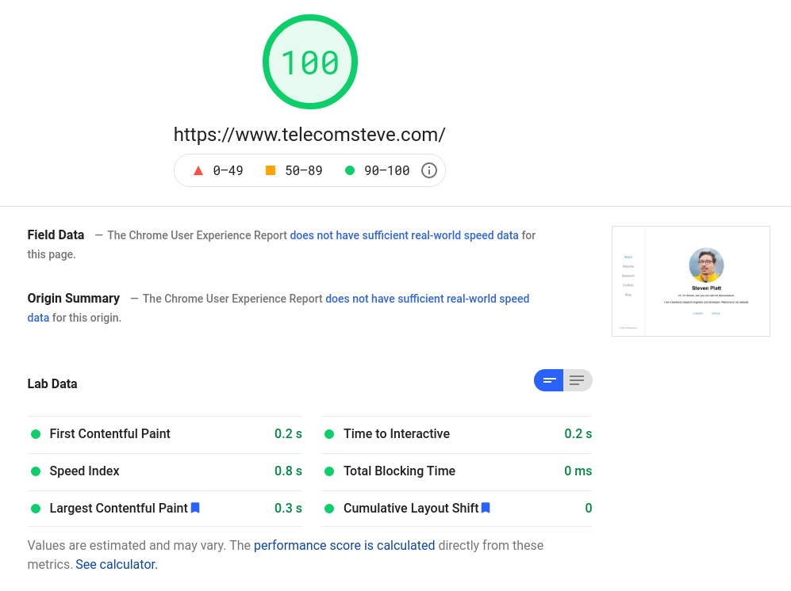

# ResearchEng Portoflio

 

### CI/CD Build Status: 

 

An html portfolio website template for Research Engineers 

**Demo Link**: https://demo.telecomsteve.com

ResearchEng Portfolio is a flat file website written entirely in HTML and CSS. It is designed to be fast and easy to maintain, while also including a section for research, which is often not included in standard developer portfolio templates.

The site is designed to be served directly from object storage such as Amazon S3 but can also be deployed using Apache, Nginx, or other web server. Example instructions for serving a website from Amazon S3 can be found [here](https://medium.com/@kyle.galbraith/how-to-host-a-website-on-s3-without-getting-lost-in-the-sea-e2b82aa6cd38).

  

### Run this site locally using Nodejs
Note that Nodejs must be already installed to your local machine ([Stack Overflow Instructions](https://stackoverflow.com/questions/6084360/using-node-js-as-a-simple-web-server)).

>1. npm install http-server -g
>1. git clone https://github.com/stevenplatt/ResearchEng-portfolio.git
>1. cd ResearchEng-portfolio/website/
>1. npx http-server

  

### Run this site locally using Docker

Note that Docker must already be installed to your local machine. ([Docker install instructions](https://docs.docker.com/get-docker/)).

>1. docker pull telecomsteve/research-eng-portfolio:main
>1. docker run --name telecomsteve -d -p 8080:80 telecomsteve/research-eng-portfolio:main

The website is now reachable at http://localhost:8080 in your browser.

  

## Desktop Page Layouts

- About
- Resume
- Research
- Portfolio
- Blog
- Blog Post

 
 
### About Page:

 

### Resume Page: 

 

### Research Page:

 

### Portfolio Page:

 

### Blog Page:

 

### Blog Post Page:

 

## Mobile Page Layouts

All pages of the ResearchEng website template are also optimized for mobile. 

 

**Google Page Speed Index: 100/100** 

For both desktop and mobile.

 

## Contributing

Bug reports and pull requests are welcome on GitHub at https://github.com/stevenplatt/ResearchEng-portfolio. This project is intended to be a safe, welcoming space for collaboration, and contributors are expected to adhere to the [Contributor Covenant](http://contributor-covenant.org) code of conduct.

 

## License

The theme is available as open source under the terms of the [MIT License](https://opensource.org/licenses/MIT).

